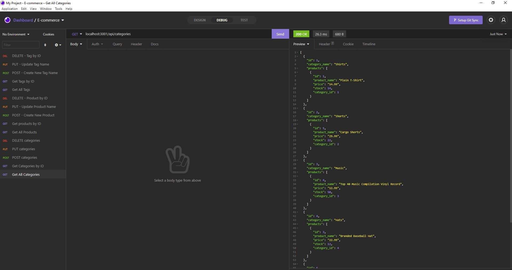

# E-commerce Back End 


## Description :
```
E_com-back_end App is Sequelize Model based back-end databse. It uses CRUD ( Create, Read, Update, Delete) methods for categories, products, tags and product tags data. Insomnia Core is utilized in to test all APIs 
```

* The requirement from Internet Retail Company's manager was as below :
```
1. This back-bnd for E-commerce website should use latest technologies.
2. When they add database name, MYSQL username, password to environment variable file, then they should be able to connect to a database using sequelize 
3. When they enter schema and seeds command, then development database is created and seeded with test data
4. Upon invoking application on command line the server starts and sequelized models get synced to MYSQL database
5. Upon running GET routes in Insomnia Core for categories, products and tags, the data for each route is displayed in JSON format
6. When testing POST, PUT and DELETE routes, it successfully process data accordingly
```

## Languages and other components used : 
```
   * Node.js 
   * npm (node package manager) 
   * Expess.js server ( Node based web server ) 
   * MySQL (Structured Query Language)
   8 Sequelize 
   * Database Queries with SELECT, INSERT, DELETE and UPDATE 
   * Insomnia Core
```

## How to install : 
 ```
 To install the application in your computer follow the steps below: 

 1. Clone the repository in your computer :
    - open the command line and go to the directory where you want to clone the repository.
    - then clone the repo by typing : " git clone git@github.com:miraj00/e_com-back_end.git "

 2. Install MySQL in your computer. 

 3. Install node.js on your computer by going to https://nodejs.org/en/  
  
 4. Once node.js is installed, type "npm init" on the cammand line Terminal at root directory.
    - This will initiate npm packages

 5. Install express, sequelize and mysql2 by typing : " npm install express sequelize mysql2 " in command line

 6. Install dotenv by typing " npm install dotenv " in command line

 7. Use " mysql -u root -p " to start MySQL Server, then enter password upon prompt 

 8. Once SQL is on, type : " source db/schema.sql; " to create database 

 9. Then You can use " exit " or " Quit " to stop the server.

 10. In command line type : " npm run seed " to seed the database 

 11. Then type : ' node server ' to invoke the application.

 11. Once above steps are done, Opne the Insomnia Core and test GET, CREATE, UPDATE and DELETE routes for Categories, Products and Tags


```
## Demo video Link (inclueds Video under link as well) of How to use the application available at  : 
```
https://drive.google.com/file/d/11lBkYvoMmT4RL0q1f2Mm3hK4rIUNB9Fz/view

```

https://user-images.githubusercontent.com/84084583/132931720-ff668570-453e-4496-9529-357d1845838f.mp4


## Below is the screenshot and Deployed application of the Project as per client request ## 




[Please click here to deploy application in Github](https://github.com/miraj00/e_com-back_end)


